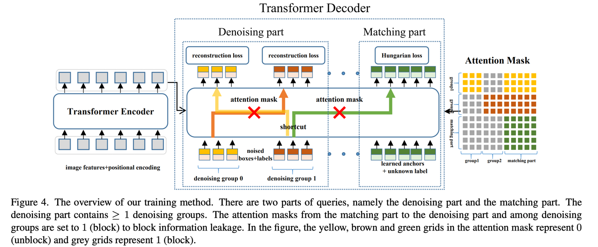
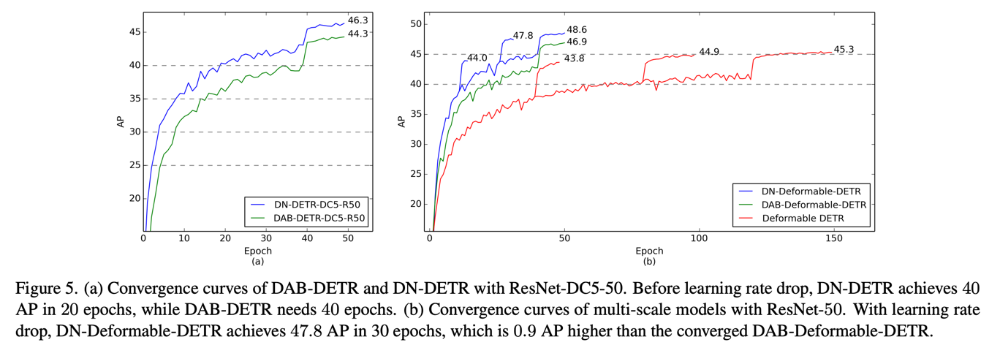

**DN-DETR**: Accelerate DETR Training by Introducing Query DeNoising
========

By [Feng Li*](https://fengli-ust.github.io/), [Hao Zhang*](https://haozhang534.github.io/), [Shilong Liu](https://scholar.google.com/citations?hl=zh-CN&user=nkSVY3MAAAAJ), [Jian Guo](https://idea.edu.cn/en/about-team/jian_guo.html), [Lionel M.Ni](https://scholar.google.com/citations?hl=zh-CN&user=OzMYwDIAAAAJ), and [Lei Zhang](https://scholar.google.com/citations?hl=zh-CN&user=fIlGZToAAAAJ).

This repository is an official implementation of the [DN-DETR](https://arxiv.org/pdf/2203.01305.pdf). Accepted to **CVPR 2022** (score **112**, **Oral** presentation). Code is avaliable now.
[[CVPR paper link](https://openaccess.thecvf.com/content/CVPR2022/papers/Li_DN-DETR_Accelerate_DETR_Training_by_Introducing_Query_DeNoising_CVPR_2022_paper.pdf)] [[extended version paper link](https://arxiv.org/pdf/2203.01305.pdf)] [[中文解读](https://www.zhihu.com/question/517340666/answer/2381304399)]

## News


[2022/12]: We release an extended version of DN-DETR on arxiv, here is the [paper link](https://arxiv.org/abs/2203.01305)! We add denoising training to CNN-based model Faster R-CNN, segmentation model Mask2Former, and other DETR-like models like Anchor DETR and DETR, to improve the performance of these models.

[2022/12]: Code for [Mask DINO](https://github.com/IDEA-Research/MaskDINO) is available! Mask DINO further Achieves **51.7** and **59.0** box AP on COCO with a ResNet-50 and SwinL without extra detection data, outperforming DINO under the same setting!

[2022/11]: DINO implementation based on DN-DETR is released in this repo. Credits to @[Vallum](https://github.com/Vallum)! This optimized version under ResNet-50 can reach [50.8 ~ 51.0 AP](https://github.com/IDEA-Research/DN-DETR/pull/45) in 36epochs.

[2022/9]: We release a toolbox [detrex](https://github.com/IDEA-Research/detrex) that provides many state-of-the-art Transformer-based detection algorithms. It includes DN-DETR with better performance.  Welcome to use it!

[2022/7] Code for [DINO](https://arxiv.org/pdf/2203.03605.pdf) is available [here](https://github.com/IDEACVR/DINO)!

[2022/6]: We release a unified detection and segmentation model [Mask DINO](https://arxiv.org/pdf/2206.02777.pdf) that achieves the best results on all the three segmentation tasks (**54.5** AP on [COCO instance leaderboard](https://paperswithcode.com/sota/instance-segmentation-on-coco-minival), **59.4** PQ on [COCO panoptic leaderboard](https://paperswithcode.com/sota/panoptic-segmentation-on-coco-minival), and **60.8** mIoU on [ADE20K semantic leaderboard](https://paperswithcode.com/sota/semantic-segmentation-on-ade20k))! Code will be available [here](https://github.com/IDEACVR/MaskDINO).

[2022/5]Our code is available! Better performance ```49.5```AP on COCO achieved with ResNet-50.

[2022/4]Code is avaliable for [DAB-DETR](https://arxiv.org/abs/2201.12329) [here](https://github.com/IDEA-opensource/DAB-DETR).

[2022/3]We build a repo [Awesome Detection Transformer](https://github.com/IDEACVR/awesome-detection-transformer) to present papers about transformer for detection and segmentation. Welcome to your attention!

[2022/3]DN-DETR is selected for an **Oral** presentation in CVPR2022.


[2022/3]We release another work [DINO:DETR with Improved DeNoising Anchor Boxes for End-to-End Object Detection](https://arxiv.org/abs/2203.03605) that for the first time establishes a DETR-like model as a SOTA model on the [leaderboard](https://paperswithcode.com/sota/object-detection-on-coco). Also based on **DN**. Code will be avaliable [here](https://github.com/IDEACVR/DINO).

## Introduction
1. We present a novel denoising training method to speedup DETR training and offer a deepened understanding of the slow convergence issue of DETR-like methods. 
2. DN is only a training method and be plugged into many DETR-like models or even traditional models to boost performance.
3. DN-DETR achieves AP **43.4** and **48.6** with 12 and 50
epochs of training 
with ResNet-50 backbone. Compared with the baseline models under the same setting, DN-DETR achieves comparable performance with **50%** training epochs.
4. Our optmized models result in better performance. DN-Deformable-DETR achieves **49.5** with a ResNet-50 backbone.


## Model
We build upon DAB-DETR and add a denoising part to accelerate training convergence. It only adds minimal computation and will be removed during inference time.

We conduct extensive experiments to validate the effectiveness of our denoising training, for example, the convergnece curve comparison. You can refer to [our paper](https://arxiv.org/pdf/2203.01305.pdf) for more experimental results.

## Model Zoo
We provide our models under **DAB-DETR**, **DAB-Deformable-DETR(deformable encoder only)**, and **DAB-Deformable-DETR** (See DAB-DETR [code](https://github.com/IDEA-opensource/DAB-DETR) and [paper](https://arxiv.org/abs/2201.12329) for more details). 

You can also refer to our 

[[model zoo in google drive]](https://drive.google.com/drive/folders/1wmiZKfOg_DIGIwyQedV4rzNqUwHVTkUv?usp=sharing) 

[[model zoo in 百度网盘]](https://pan.baidu.com/s/13Dc_DgliVps4bHVlNujA4Q?pwd=niet)（提取码niet）.

### 50 epoch setting
<table>
  <thead>
    <tr style="text-align: right;">
      <th></th>
      <th>name</th>
      <th>backbone</th>
      <th>box AP</th>
      <th>Log/Config/Checkpoint</th>
      <th>Where in <a href="https://arxiv.org/pdf/2203.01305.pdf">Our Paper</a></th>
    </tr>
  </thead>
  <tbody>
    <tr>
      <th>0</th>
      <td>DN-DETR-R50</td>
      <td>R50</td>
      <td>44.4<sup><a id="sup3c" herf="#sup1">1</a></sup></td>
      <td><a href="https://drive.google.com/drive/folders/1kuwScU8PhN61qQOl5bbiPhKAYbzDHsWs?usp=sharing">Google Drive</a>&nbsp/&nbsp<a href="https://pan.baidu.com/s/1TqvnjsbAjARZp1i8cB2w8A?pwd=niet">BaiDu</a>&nbsp</td>
      <td>Table 1</td>
    </tr>
    <tr>
      <th>2</th>
      <td>DN-DETR-R50-DC5</td>
      <td>R50</td>
      <td>46.3</td>
      <td><a href="https://drive.google.com/drive/folders/1jr8BdDdMu8esABXdU3lNY7fpWVxAJtWa?usp=sharing">Google Drive</a>&nbsp/&nbsp<a href="https://pan.baidu.com/s/1lWrLUkxNfrncRTM-zmpbeA?pwd=niet">BaiDu</a>&nbsp;</td>
      <td>Table 1</td>
    </tr>
    <tr>
      <th>5</th>
      <td>DN-DAB-Deformbale-DETR<br>(Deformbale Encoder Only)<sup><a id="sup3c" herf="#sup3">3</a></sup></td>
      <td>R50</td>
      <td>48.6</td>
      <td><a href="https://drive.google.com/drive/folders/1TLIuvMw6F9lBv77gWQ3Qcn5tdfG7kqdU?usp=sharing">Google Drive</a>&nbsp/&nbsp<a href="https://pan.baidu.com/s/1emOumSadTJbCcoqxhKnllQ?pwd=niet">BaiDu</a>&nbsp</td>
      <td>Table 3</td>
    </tr>
    <tr>
      <th>6</th>
      <td>DN-DAB-Deformable-DETR-R50-v2<sup><a id="sup4c" herf="#sup4">4</a></sup></td>
      <td>R50</td>
      <td>49.5 (48.4 in 24 epochs)</td>
      <td><a href="https://drive.google.com/drive/folders/1pIllR0VfSIqX8TmQy0PFNiPdp87j-78j?usp=sharing">Google Drive</a>&nbsp/&nbsp<a href="https://pan.baidu.com/s/1ugoXlpr3x72qcXPKQ669sA?pwd=niet">BaiDu</a>&nbsp</td>
      <td>Optimized implementation with deformable attention in both encoder and decoder. See <a href="https://github.com/IDEA-opensource/DAB-DETR">DAB-DETR</a> for more details.</td>
    </tr>
  </tbody>
</table>

### 12 epoch setting
<table>
  <thead>
    <tr style="text-align: right;">
      <th></th>
      <th>name</th>
      <th>backbone</th>
      <th>box AP</th>
      <th>Log/Config/Checkpoint</th>
      <th>Where in <a href="https://arxiv.org/pdf/2203.01305.pdf">Our Paper</a></th>
    </tr>
  </thead>
  <tbody>
    <tr>
      <th>1</th>
      <td>DN-DAB-DETR-R50-DC5(3 pat)<sup><a id="sup2c" herf="#sup1">2</a></sup></td>
      <td>R50</td>
      <td>41.7</td>
      <td><a href="https://drive.google.com/drive/folders/1jWSIWTWgoiIvyA7w2xIkdk-B1pS2atPA?usp=sharing">Google Drive</a>&nbsp/&nbsp<a href="https://pan.baidu.com/s/1fgCIGpMf0cgO6ToIb0xFuA?pwd=niet">BaiDu</a>&nbsp</td>
      <td>Table 2</td>
    </tr>
    <tr>
      <th>4</th>
      <td>DN-DAB-DETR-R101-DC5(3 pat)<sup><a id="sup2c" herf="#sup1">2</a></sup></td>
      <td>R101</td>
      <td>42.8</td>
      <td><a href="https://drive.google.com/drive/folders/1elPn06gs8mNxR3jtE53zi4cK5qLGH0AV?usp=sharing">Google Drive</a>&nbsp/&nbsp<a href="https://pan.baidu.com/s/1fgCIGpMf0cgO6ToIb0xFuA?pwd=niet">BaiDu</a>&nbsp</td>
      <td>Table 2</td>
    </tr>
    <tr>
      <th>5</th>
      <td>DN-DAB-Deformbale-DETR<br>(Deformble Encoder Only)<sup><a id="sup3c" herf="#sup3">3</a></sup></td>
      <td>R50</td>
      <td>43.4</td>
      <td><a href="https://drive.google.com/drive/folders/1T-qiHrvDF38PyqLhMU3QFC_n-ZkVgMJh?usp=sharing">Google Drive</a>&nbsp/&nbsp<a href="https://pan.baidu.com/s/1XygS_bjhe8Gg9tFhs9Z6uQ?pwd=niet">BaiDu</a>&nbsp</td>
      <td>Table 2</td>
    </tr>
    <tr>
      <th>5</th>
      <td>DN-DAB-Deformbale-DETR<br>(Deformble Encoder Only)<sup><a id="sup3c" herf="#sup3">3</a></sup></td>
      <td>R101</td>
      <td>44.1</td>
      <td><a href="https://drive.google.com/drive/folders/1V8CH7AMf9HGUYNNgEYaGK_2g2T2LNNWD?usp=sharing">Google Drive</a>&nbsp/&nbsp<a href="https://pan.baidu.com/s/1Q_C7FMXAlyPcWkIhbf5M6g?pwd=niet">BaiDu</a>&nbsp</td>
      <td>Table 2</td>
    </tr>
  </tbody>
</table>

Notes: 
- <sup><a id="sup1" herf="#sup1c">1</a></sup>: The result increases compared with the reported one in our paper (from ```44.1```to ```44.4```) since we optimized the code. We did not rerun other models, so
  <font color=red>**you are expected to get better performance than reported ones in our paper**.</font>
- <sup><a id="sup2" herf="#sup2c">2</a></sup>: The models with marks (3 pat) are trained with multiple pattern embeds (refer to Anchor DETR or [DAB-DETR](https://arxiv.org/pdf/2203.01305.pdf) for more details.).
- <sup><a id="sup3" herf="#sup3c">3</a></sup>: This model is based on DAB-Deformbale-DETR(Deformbale Encoder Only), which is a multiscale version of DAB-DETR. It requires 16 GPUs to train as it only use deformable attention in the encoder. 
- <sup><a id="sup4" herf="#sup4c">4</a></sup>: This model is based on DAB-Deformbale-DETR which is an optimized implementation with deformable DETR. See <a href="https://github.com/IDEA-opensource/DAB-DETR">DAB-DETR</a> for more details. 
  <font color=red>**You are encouraged to use this
deformable version**</font> as it uses deformable attention in both encoder and deocder, which is more lightweight (i.e, train with 4/8 A100 GPUs) and converges faster (i.e, achieves ```48.4``` in 24 epochs, comparable to the 50-epoch DAB-Deformable-DETR).

# Usage
## How to use denoising training in your own model
Our code largely follows DAB-DETR and adds additional components for denoising training, which are warped in a file [dn_components.py](models/DAB_DETR/dn_components.py). There are mainly 3 functions including **prepare_for_dn**, **dn_post_proces** (the first two are used in your detection forward function to process the dn part), and **compute_dn_loss**(this one is used to calculate dn loss). You can import these functions and add them to your own detection model.
You may also compare DN-DETR and DAB-DETR to see how these functions are added if you would like to use it in your own detection models.

You are also encouraged to apply it to some other DETR-like models or even traditional detection models and update results
in this repo.


## Installation
We use the DAB-DETR project as our codebase, hence no extra dependency is needed for our **DN-DETR**. For the **DN-Deformable-DETR**, you need to compile the deformable attention operator manually.

We test our models under ```python=3.7.3,pytorch=1.9.0,cuda=11.1```. Other versions might be available as well.

1. Clone this repo
```sh
git clone https://github.com/IDEA-Research/DN-DETR.git
cd DN-DETR
```

2. Install Pytorch and torchvision

Follow the instruction on https://pytorch.org/get-started/locally/.
```sh
# an example:
conda install -c pytorch pytorch torchvision
```

3. Install other needed packages
```sh
pip install -r requirements.txt
```

4. Compiling CUDA operators
```sh
cd models/dn_dab_deformable_detr/ops
python setup.py build install
# unit test (should see all checking is True)
python test.py
cd ../../..
```

## Data
Please download [COCO 2017](https://cocodataset.org/) dataset and organize them as following:
```
COCODIR/
  ├── train2017/
  ├── val2017/
  └── annotations/
  	├── instances_train2017.json
  	└── instances_val2017.json
```


## Run
We use the standard **DN-DETR-R50** and **DN-Deformable-DETR-R50** as examples for training and evalulation.

### Eval our pretrianed models

Download our DN-DETR-R50 model checkpoint from [this link](https://drive.google.com/drive/folders/1kuwScU8PhN61qQOl5bbiPhKAYbzDHsWs?usp=sharing) and perform the command below. 
You can expect to get the final AP about ```44.4```.

For our DN-DAB-Deformable-DETR_Deformable_Encoder_Only ([download here](https://drive.google.com/drive/folders/1TLIuvMw6F9lBv77gWQ3Qcn5tdfG7kqdU?usp=sharing)). The final AP expected is ```48.6```.

For our DN-DAB-Deformable-DETR ([download here](https://drive.google.com/drive/folders/1pIllR0VfSIqX8TmQy0PFNiPdp87j-78j?usp=sharing)), the final AP expected is ```49.5```.

```sh
# for dn_detr: 44.1 AP; optimized result is 44.4AP
python main.py -m dn_dab_detr \
  --output_dir logs/dn_DABDETR/R50 \
  --batch_size 1 \
  --coco_path /path/to/your/COCODIR \ # replace the args to your COCO path
  --resume /path/to/our/checkpoint \ # replace the args to your checkpoint path
  --use_dn \
  --eval

# for dn_deformable_detr: 49.5 AP
python main.py -m dn_deformable_detr \
  --output_dir logs/dab_deformable_detr/R50 \
  --batch_size 1 \
  --coco_path /path/to/your/COCODIR \ # replace the args to your COCO path
  --resume /path/to/our/checkpoint \ # replace the args to your checkpoint path
  --transformer_activation relu \
  --use_dn \
  --eval
  
# for dn_deformable_detr_deformable_encoder_only: 48.6 AP
python main.py -m dn_dab_deformable_detr_deformable_encoder_only 
  --output_dir logs/dab_deformable_detr/R50 \
  --batch_size 1 \
  --coco_path /path/to/your/COCODIR \ # replace the args to your COCO path
  --resume /path/to/our/checkpoint \ # replace the args to your checkpoint path
  --transformer_activation relu \
  --num_patterns 3 \  # use 3 pattern embeddings
  --use_dn  \
  --eval
```


### Training your own models
Similarly, you can also train our model on a single process: 
```sh
# for dn_detr
python main.py -m dn_dab_detr \
  --output_dir logs/dn_DABDETR/R50 \
  --batch_size 1 \
  --epochs 50 \
  --lr_drop 40 \
  --coco_path /path/to/your/COCODIR  # replace the args to your COCO path
  --use_dn
```


### Distributed Run
However, as the training is time consuming, we suggest to train the model on multi-device.

If you plan to train the models on a cluster with Slurm, here is an example command for training:
```sh
# for dn_detr: 44.4 AP
python run_with_submitit.py \
  --timeout 3000 \
  --job_name DNDETR \
  --coco_path /path/to/your/COCODIR \
  -m dn_dab_detr \
  --job_dir logs/dn_DABDETR/R50_%j \
  --batch_size 2 \
  --ngpus 8 \
  --nodes 1 \
  --epochs 50 \
  --lr_drop 40 \
  --use_dn

# for dn_dab_deformable_detr: 49.5 AP
python run_with_submitit.py \
  --timeout 3000 \
  --job_name dn_dab_deformable_detr \
  --coco_path /path/to/your/COCODIR \
  -m dab_deformable_detr \
  --transformer_activation relu \
  --job_dir logs/dn_dab_deformable_detr/R50_%j \
  --batch_size 2 \
  --ngpus 8 \
  --nodes 1 \
  --epochs 50 \
  --lr_drop 40 \
  --use_dn

# for dn_dab_deformable_detr_deformable_encoder_only: 48.6 AP
python run_with_submitit.py \
  --timeout 3000 \
  --job_name dn_dab_deformable_detr_deformable_encoder_only \
  --coco_path /path/to/your/COCODIR \
  -m dn_dab_deformable_detr_deformable_encoder_only \
  --transformer_activation relu \
  --job_dir logs/dn_dab_deformable_detr/R50_%j \
  --num_patterns 3 \ 
  --batch_size 1 \
  --ngpus 8 \
  --nodes 2 \
  --epochs 50 \
  --lr_drop 40 \
  --use_dn
```
If you want to train our DC reversion or mulitple-patterns version, add 
```sh
--dilation  # for DC version

--num_patterns 3  # for 3 patterns
```
However, this requires additional training resources and memory, i.e, use 16 GPUs.

The final AP should be similar or better to ours, as our optimized result is better than our reported
performance in the paper( for example, we report ```44.1``` for **DN-DETR**, but our new result can achieve ```44.4```. 
Don't be surprised if you get better result! ). 

Our training setting is same as DAB-DETR but add a argument ```--use_dn```, you may also refer to
 [DAB-DETR](https://github.com/IDEA-opensource/DAB-DETR) as well. 

Notes: 
  - The results are sensitive to the batch size. We use 16(2 images each GPU x 8 GPUs) by default.


Or run with multi-processes on a single node:
```sh
# for dn_dab_detr: 44.4 AP
python -m torch.distributed.launch --nproc_per_node=8 \
  main.py -m dn_dab_detr \
  --output_dir logs/dn_DABDETR/R50 \
  --batch_size 2 \
  --epochs 50 \
  --lr_drop 40 \
  --coco_path /path/to/your/COCODIR \
  --use_dn

# for dn_deformable_detr: 49.5 AP
python -m torch.distributed.launch --nproc_per_node=8 \
  main.py -m dn_dab_deformable_detr \
  --output_dir logs/dn_dab_deformable_detr/R50 \
  --batch_size 2 \
  --epochs 50 \
  --lr_drop 40 \
  --transformer_activation relu \
  --coco_path /path/to/your/COCODIR \
  --use_dn
```


## Links
Our work is based on **DAB-DETR**. We also release another [SOAT](https://paperswithcode.com/sota/object-detection-on-coco) detection model **DINO** based on DN-DETR and DAB-DETR.   
- **DINO: DETR with Improved DeNoising Anchor Boxes for End-to-End Object Detection**.     
Hao Zhang*, Feng Li*, Shilong Liu*, Lei Zhang, Hang Su, Jun Zhu, Lionel M. Ni, Heung-Yeung Shum.  
arxiv 2022.   
[[paper]](https://arxiv.org/abs/2203.03605) [[code]](https://github.com/IDEACVR/DINO).  

- **DAB-DETR: Dynamic Anchor Boxes are Better Queries for DETR**.  
Shilong Liu, Feng Li, Hao Zhang, Xiao Yang, Xianbiao Qi, Hang Su, Jun Zhu, Lei Zhang.    
International Conference on Learning Representations (ICLR) 2022.  
[[Paper]](https://arxiv.org/abs/2201.12329) [[Code]](https://github.com/SlongLiu/DAB-DETR).     

## LICNESE
DN-DETR is released under the Apache 2.0 license. Please see the [LICENSE](LICNESE) file for more information.

Copyright (c) IDEA. All rights reserved.

Licensed under the Apache License, Version 2.0 (the "License"); you may not use these files except in compliance with the License. You may obtain a copy of the License at http://www.apache.org/licenses/LICENSE-2.0

Unless required by applicable law or agreed to in writing, software distributed under the License is distributed on an "AS IS" BASIS, WITHOUT WARRANTIES OR CONDITIONS OF ANY KIND, either express or implied. See the License for the specific language governing permissions and limitations under the License.

## Bibtex
If you find our work helpful for your research, please consider citing the following BibTeX entry.   
```
@inproceedings{li2022dn,
  title={Dn-detr: Accelerate detr training by introducing query denoising},
  author={Li, Feng and Zhang, Hao and Liu, Shilong and Guo, Jian and Ni, Lionel M and Zhang, Lei},
  booktitle={Proceedings of the IEEE/CVF Conference on Computer Vision and Pattern Recognition},
  pages={13619--13627},
  year={2022}
}
```
